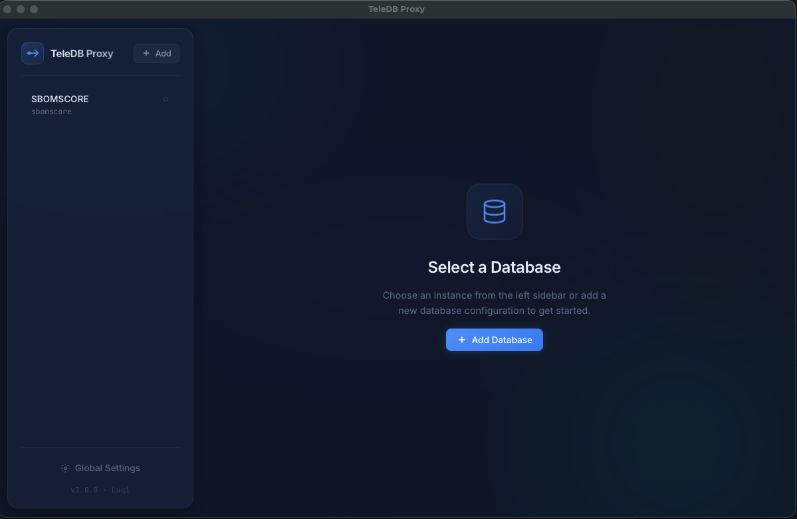

# TeleDB Proxy

A desktop application for connecting to databases via [Teleport](https://goteleport.com/) without dealing with command-line flags. Built with **Tauri v2** (Rust backend + Vite frontend).



## Features

- **Database Management** — Add, edit, and delete database configurations
- **One-Click Proxy** — Launch `tsh proxy db` sessions with a single click
- **Interactive Terminal** — View live output with automatic password/OTP prompts
- **Multiple Sessions** — Run multiple proxy sessions simultaneously
- **Global Settings** — Configure Teleport proxy host and username once

## Prerequisites

- [Rust](https://www.rust-lang.org/tools/install) (stable)
- [Node.js](https://nodejs.org/) (v18+)
- Teleport CLI (`tsh`) installed and in PATH

## Development

```bash
# Install Node dependencies
npm install

# Run the Tauri app in development mode
npm run tauri dev
```

## Build

```bash
# Build the application bundle for your platform
npm run tauri build
```

The compiled binary will be in `src-tauri/target/release/bundle/`.

## Architecture

| Layer | Technology | Purpose |
|-------|-----------|---------|
| **Backend** | Rust + Tauri v2 | State management, PTY process execution, file I/O |
| **Frontend** | Vite + Vanilla JS/CSS | UI with glassmorphic design system |
| **PTY** | `portable-pty` | Interactive `tsh` sessions with password/OTP support |
| **Storage** | JSON files | Database configs & global settings in app data dir |

## Project Structure

```
teleport-ui/
├── index.html              # Vite entry point
├── src/
│   ├── main.js             # Frontend entry point
│   ├── modules/            # UI modules (state, proxy, etc.)
│   ├── style.css           # Design system & styles
│   └── favicon.svg         # App icon
├── src-tauri/
│   ├── src/                # Rust backend source
│   ├── Cargo.toml          # Rust dependencies
│   └── tauri.conf.json     # Tauri configuration
└── package.json            # Node dependencies
```

## Troubleshooting

### macOS: "TeleDB Proxy is damaged and can't be opened"
If you download the application outside the Mac App Store and see an error saying the app is damaged and should be moved to the Trash, this is macOS **Gatekeeper** putting the app in quarantine because it is unsigned.

**To fix this:**
1. Move the `TeleDB Proxy.app` to your **Applications** folder.
2. Open the **Terminal** app.
3. Run the following command to remove the quarantine attribute:
   ```bash
   xattr -cr "/Applications/TeleDB Proxy.app"
   ```
4. Double-click the app to open it normally.

## License

Open sourced for [Stockbit](https://stockbit.com).
