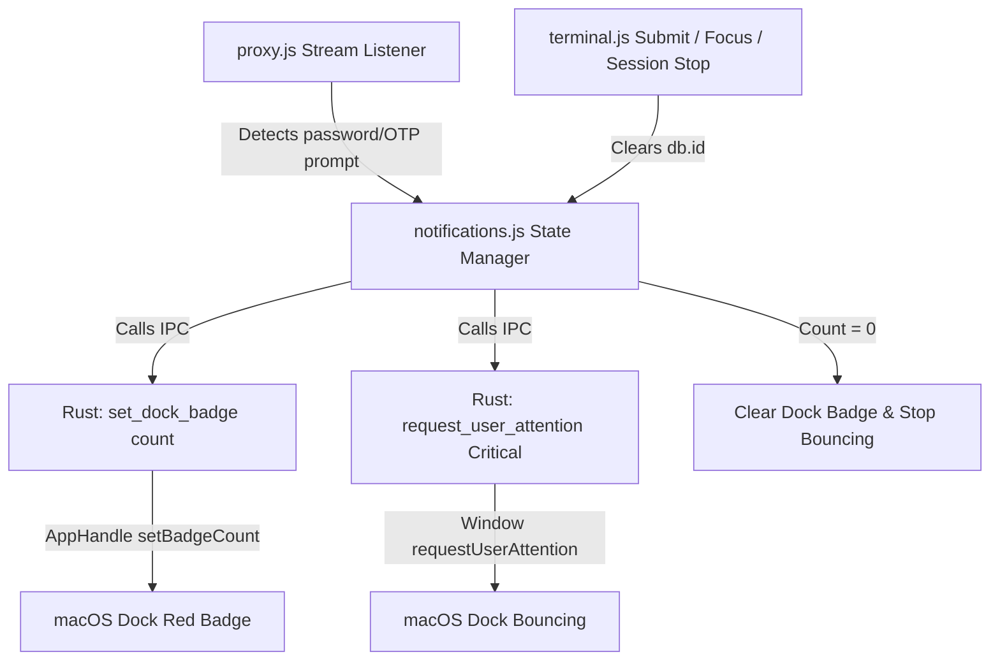

# Design Spec: TeleDb Proxy macOS Dock Notification & Red Badge Count

**Date:** 2026-08-13  
**Status:** Approved  
**Target Platform:** macOS (Tauri v2 Desktop App)

---

## 1. Overview & Goals

When `tsh proxy db` session inside Teleport UI encounters a prompt requiring user authentication re-input (e.g. `Password:`, `OTP:`, `MFA:`, `Authenticator token:`), the application needs to notify the user even when the app is in the background or unfocused.

### Key Deliverables
1. **macOS Dock Icon Bouncing**: Continuously bounce the macOS Dock icon (`UserAttentionType::Critical`) when a password/OTP prompt is detected.
2. **macOS Dock Red Badge Count**: Display a red badge count on the Dock icon indicating the total number of active database proxy sessions requiring authentication input.
3. **Automatic Lifecycle Cleanup**: Stop bouncing when the window gains focus or when input is submitted; automatically clear the red badge when all pending authentication prompts are answered or closed.

---

## 2. System Architecture

### Components

#### 1. Rust Backend (`src-tauri/src/commands.rs` & `src-tauri/src/lib.rs`)
Exposes two Tauri IPC commands:
- `set_dock_badge(app_handle: tauri::AppHandle, count: Option<i64>) -> Result<(), String>`
  - Uses `app_handle.set_badge_count(count)` provided by Tauri v2 to update the macOS Dock badge. `Some(count)` sets the count badge (cleared if `count` is 0 or `None`).
- `request_user_attention(window: tauri::WebviewWindow, critical: bool) -> Result<(), String>`
  - Calls `window.request_user_attention(Some(UserAttentionType::Critical))` if `critical == true` to bounce Dock icon until canceled or focused. Pass `None` if `critical == false` to cancel bouncing.

#### 2. Frontend State Manager (`src/modules/notifications.js`)
Maintains global notification state:
- `pendingAuthRequests`: `Set<string>` containing `db.id` for databases currently awaiting password/OTP input.
- `notifyAuthRequired(dbId: string)`:
  - Adds `dbId` to `pendingAuthRequests`.
  - Invokes `set_dock_badge` with total count (`pendingAuthRequests.size`).
  - Invokes `request_user_attention` with `critical: true`.
- `clearAuthRequired(dbId: string)`:
  - Removes `dbId` from `pendingAuthRequests`.
  - Invokes `set_dock_badge` with remaining count (or `null` if count is 0).
  - If count is 0, invokes `request_user_attention` with `critical: false`.
- `setupNotificationListeners()`:
  - Listens to window `focus` event to stop Dock bouncing immediately when the user switches to the app window, while preserving the badge count until password is entered/closed.

#### 3. Integration Points
- **`src/main.js`**: Calls `setupNotificationListeners()` on application startup.
- **`src/modules/proxy.js`**:
  - Triggers `notifyAuthRequired(db.id)` whenever stdout stream parsing detects `password:` or `otp`/`token`/`mfa` prompts.
  - Triggers `clearAuthRequired(db.id)` on proxy session disconnect, close, or error events.
- **`src/modules/terminal.js`**:
  - Triggers `clearAuthRequired(sess.dbId)` when password/OTP input is submitted via `submitAction()`.
  - Stores `dbId` on the session object so `clearAuthRequired` knows which DB to resolve.

---

## 3. Data Flow & Edge Cases

### Data Flow Sequence
1. **Detection**: `proxy.js` receives stdout chunk matching password/OTP prompt state.
2. **Notification Trigger**: `notifyAuthRequired(db.id)` is called → `pendingAuthRequests` size increases → Dock badge count set → Dock bouncing started.
3. **User Action**:
   - User clicks app on Dock / focuses window → `focus` event stops bouncing, red badge stays visible.
   - User inputs password & presses Enter → `clearAuthRequired(db.id)` called → `pendingAuthRequests` size decreases.
   - When all pending prompts resolved → badge cleared (`null`), bouncing canceled.

### Edge Case Matrix
| Edge Case Scenario | Handled Behavior |
|---|---|
| Multiple DB sessions requesting password at once | `Set<string>` ensures unique `db.id` entries; Dock badge shows actual pending count (e.g. `2`). |
| User closes or stops proxy session while prompt is open | `proxy.js` closed listener calls `clearAuthRequired(db.id)`, decrementing badge count. |
| Teleport rejects password and re-prompts | `notifyAuthRequired(db.id)` re-runs safely (`Set` deduplicates `db.id`), maintaining badge and re-triggering Dock bounce. |
| Non-macOS OS running the app | Tauri `set_badge_count` and `request_user_attention` are safe no-ops or handled gracefully by Tauri window management. |

---

## 4. Verification & Plan

### Verification Steps
1. Run `make dev` and connect to a database proxy requiring password login.
2. Unfocus/minimize app window.
3. Verify macOS Dock icon bounces ("mantul2") and red badge count appears (`1`).
4. Focus window → verify Dock bounce stops immediately.
5. Enter password → verify red badge disappears.
